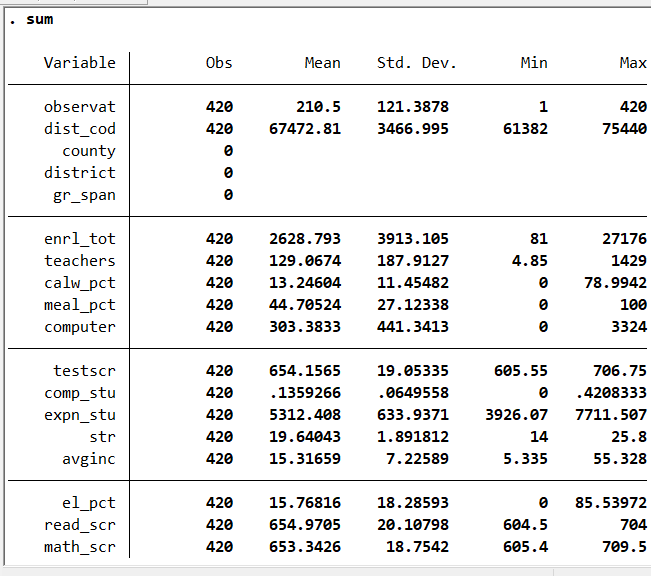

<!-- README.md is generated from README.Rmd. Please edit that file -->
<!-- badges: start -->
[](https://travis-ci.org/danicamiguel/emetricsrsw)
<!-- badges: end -->

```{r, include = FALSE}
knitr::opts_chunk$set(
  collapse = TRUE,
  comment = "#>",
  fig.path = "man/figures/README-",
  out.width = "100%"
)
```

# emetricsrsw

The goal of `emetricsrsw` package is to support the exercises and examples from Chapter 5 of *Introduction to Econometrics* by James H. Stock and Mark W. Watson. Since this textbook was designed to assist learning in introductory econometrics courses, it's expected that users of the textbook will use statistical analysis software program STATA. However, given that STATA is not an open-source and free software (i.e. you must pay to obtain an operating license) this makes it inaccessible to those interested in learning econometrics from this textbook. `emetricsrsw` allows users to utilize some of the most commonly used STATA commands in R to perform statistical analysis - making it convenient and accessible for all readers of this textbook interested in learning econometrics without having to use STATA. It also takes some of the pressure off from those familiar with STATA commands but aren't as familiar with R's interface. Have fun!

## Installation

`emetricsrsw` is hosted on Github and can be installed by running the following: 
```{r, eval = FALSE}
devtools::install_github("danicamiguel/emetricsrsw")
```

## Load

```{r}
library(emetricsrsw)
```

## Data

The California Standardized Testing and Reporting dataset contains data on test performance, school characteristics and student demographic backgrounds. All of these data were obtained from the [California Department of Education](http://www.cde.ca.gov). For more information about this dataset see the [Companion Website](https://wps.pearsoned.com/aw_stock_ie_3/178/45691/11696965.cw/index.html) for Stock and Watson's Introduction to Econometrics. 

The Birthweight_Smoking dataset contains data of infant births and dead in Pennsylvania in 1989. For more information about this dataset see the [Companion Website](https://wps.pearsoned.com/aw_stock_ie_3/178/45691/11696965.cw/index.html) for Stock and Watson's Introduction to Econometrics. 

## Functionality

`stata_sum`: provides summary statistics for all variables in a dataset

`stata_sum_var`: provides summary statistics for a variable in a dataset chosen by user

`stata_desc`: gives description of all variables in dataset, including variable classes (i.e. double, character, factor)

`stata_list`: allows user to see all the observations of the dataset in a table

`stata_list_2`: allows user to see a the first two rows of a given dataset

`stata_list_10`: allows user to see a the first ten rows of a given dataset

`stata_graph`: plots a scatterplot

`stata_reg`: produces result summaries of a fitted model

`stata_ci`: finds the confidence interval of a fitted linear model

`stata_logit`: produces summary results of a fitted logistic model


```{r echo = FALSE}
library(knitr)
```

## Example: Dataset Summary Statistics 
```{r}
stata_sum(caschool)
```

```{r, out.width = "50%", fig.pos="h", echo = FALSE, fig.align='center'}

```

<center> _Summary of caschool dataset using STATA's *sum* command._ </center>

## Example: Variable Summary Statistics 
```{r}
stata_sum_var(caschool$enrl_tot, caschool)
```

```{r, out.width = "50%", fig.pos="h", echo = FALSE, fig.align='center'}
include_graphics("sum_enrollment.png")
```

<center> _Summary of enrollment variable using STATA's *sum* command._ </center>

## Contributors

- [Lizette Carpenter](https://github.com/lcarpenter20)
- [Fatima Keita](https://github.com/fatimak98)
- [Danica Miguel](https://github.com/danicamiguel)
