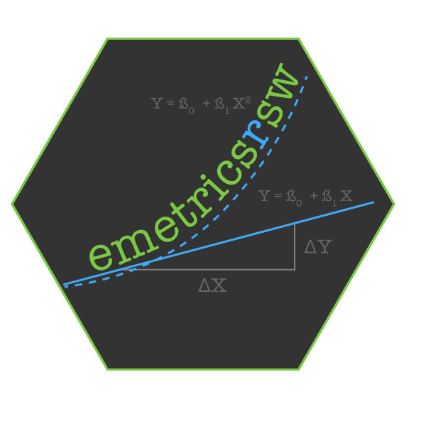

# 

<!-- README.md is generated from README.Rmd. Please edit that file -->

<!-- badges: start -->

[](https://travis-ci.org/danicamiguel/emetricsrsw)
<!-- badges: end -->

# emetricsrsw

## Brief Summary of Econometrics

Econometrics is the quantitative application of statistical methods used
to evaluate theories and models in economics. Econometrics sits at the
intersection of multiple regression and macroeconomic and microeconomic
theory.

## What is `emetricsrsw`?

The goal of the `emetricsrsw` package is meant to serve as a companion
to Chapter 5 of the textbook *Introduction to Econometrics* by James H.
Stock and Mark W. Watson. Since this textbook was designed to assist
learning in introductory econometrics courses taught at the
undergraduate level, it’s expected that students will use the
statistical analysis software, STATA, in order to complete the exercises
and examples provided in the book. Unlike R, STATA is not a free,
open-source platform - you must purchase an operating license in order
to obtain the software.

However, let’s say that students taking this course do not have access
to STATA when they need (i.e. if you’re off campus for the weekend, but
have an assignment to complete that contains questions from this
textbook).

This is where `emetricsrsw` comes in handy. This package has two main
goals:

  - Accessibility : Allow students who are familiar with STATA’s syntax
    and code, but have access to R to complete their statistical
    analysis as they would in STATA.

  - Enhanced Learning : This allows students who are using Stock and
    Watson’s econometrics textbook to enhance their learning experience
    by using R to complete exercises traditionally done only in STATA.
    This will be especially exciting for first-time R users\!

Chapter 5 of *Introduction to Econometrics* discusses hypothesis testing
and confidence intervals for single linear regression.

## Installation

`emetricsrsw` is hosted on Github and can be installed by running the
following:

``` r
devtools::install_github("danicamiguel/emetricsrsw")
```

## Load

``` r
library(emetricsrsw)
```

## Data

The California Standardized Testing and Reporting dataset contains data
on test performance, school characteristics and student demographic
backgrounds. All of these data were obtained from the [California
Department of Education](http://www.cde.ca.gov). For more information
about this dataset see the [Companion
Website](https://wps.pearsoned.com/aw_stock_ie_3/178/45691/11696965.cw/index.html)
for Stock and Watson’s Introduction to Econometrics.

The Birthweight\_Smoking dataset contains data of infant births and dead
in Pennsylvania in 1989. For more information about this dataset see the
[Companion
Website](https://wps.pearsoned.com/aw_stock_ie_3/178/45691/11696965.cw/index.html)
for Stock and Watson’s Introduction to Econometrics.

## Functionality

`stata_sum`: provides summary statistics for all variables in a dataset

`stata_sum_var`: provides summary statistics for a variable in a dataset
chosen by user

`stata_desc`: gives description of all variables in dataset, including
variable classes (i.e. double, character, factor)

`stata_list`: allows user to see all the observations of the dataset in
a table

`stata_list_2`: allows user to see a the first two rows of a given
dataset

`stata_list_10`: allows user to see a the first ten rows of a given
dataset

`stata_graph`: plots a scatterplot

`stata_reg`: produces result summaries of a fitted model

`stata_ci`: finds the confidence interval of a fitted linear model

`stata_logit`: produces summary results of a fitted logistic model

## Example: Dataset Summary Statistics

``` r
stata_sum(caschool)
#>  Observation Number    dist_cod        county            district        
#>  Min.   :  1.0      Min.   :61382   Length:420         Length:420        
#>  1st Qu.:105.8      1st Qu.:64308   Class :character   Class :character  
#>  Median :210.5      Median :67760   Mode  :character   Mode  :character  
#>  Mean   :210.5      Mean   :67473                                        
#>  3rd Qu.:315.2      3rd Qu.:70419                                        
#>  Max.   :420.0      Max.   :75440                                        
#>    gr_span             enrl_tot          teachers          calw_pct     
#>  Length:420         Min.   :   81.0   Min.   :   4.85   Min.   : 0.000  
#>  Class :character   1st Qu.:  379.0   1st Qu.:  19.66   1st Qu.: 4.395  
#>  Mode  :character   Median :  950.5   Median :  48.56   Median :10.520  
#>                     Mean   : 2628.8   Mean   : 129.07   Mean   :13.246  
#>                     3rd Qu.: 3008.0   3rd Qu.: 146.35   3rd Qu.:18.981  
#>                     Max.   :27176.0   Max.   :1429.00   Max.   :78.994  
#>     meal_pct         computer         testscr         comp_stu      
#>  Min.   :  0.00   Min.   :   0.0   Min.   :605.5   Min.   :0.00000  
#>  1st Qu.: 23.28   1st Qu.:  46.0   1st Qu.:640.0   1st Qu.:0.09377  
#>  Median : 41.75   Median : 117.5   Median :654.5   Median :0.12546  
#>  Mean   : 44.71   Mean   : 303.4   Mean   :654.2   Mean   :0.13593  
#>  3rd Qu.: 66.86   3rd Qu.: 375.2   3rd Qu.:666.7   3rd Qu.:0.16447  
#>  Max.   :100.00   Max.   :3324.0   Max.   :706.8   Max.   :0.42083  
#>     expn_stu         str            avginc           el_pct      
#>  Min.   :3926   Min.   :14.00   Min.   : 5.335   Min.   : 0.000  
#>  1st Qu.:4906   1st Qu.:18.58   1st Qu.:10.639   1st Qu.: 1.941  
#>  Median :5215   Median :19.72   Median :13.728   Median : 8.778  
#>  Mean   :5312   Mean   :19.64   Mean   :15.317   Mean   :15.768  
#>  3rd Qu.:5601   3rd Qu.:20.87   3rd Qu.:17.629   3rd Qu.:22.970  
#>  Max.   :7712   Max.   :25.80   Max.   :55.328   Max.   :85.540  
#>     read_scr        math_scr    
#>  Min.   :604.5   Min.   :605.4  
#>  1st Qu.:640.4   1st Qu.:639.4  
#>  Median :655.8   Median :652.5  
#>  Mean   :655.0   Mean   :653.3  
#>  3rd Qu.:668.7   3rd Qu.:665.9  
#>  Max.   :704.0   Max.   :709.5
```


<center>

<i>Summary of caschool dataset using STATA’s <b>sum</b> command.</i>

</center>

## Example: Variable Summary Statistics

``` r
stata_sum_var(caschool$enrl_tot, caschool)
#>  min  Q1 median   Q3   max     mean       sd   n missing
#>   81 379  950.5 3008 27176 2628.793 3913.105 420       0
```


<center>

<i>Summary of enrollment variable using STATA’s <b>sum</b> command</i>

</center>

## Contributors

  - [Lizette Carpenter](https://github.com/lcarpenter20)
  - [Fatima Keita](https://github.com/fatimak98)
  - [Danica Miguel](https://github.com/danicamiguel)
